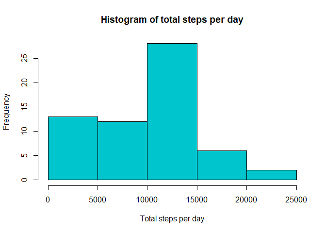
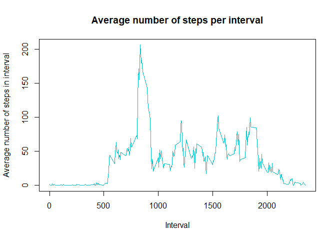
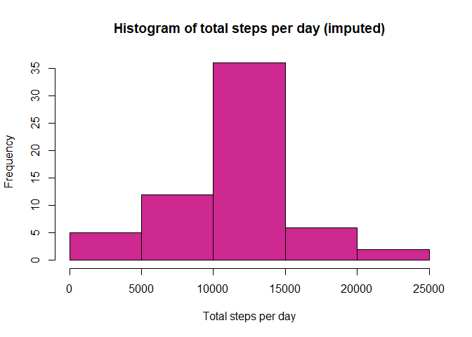
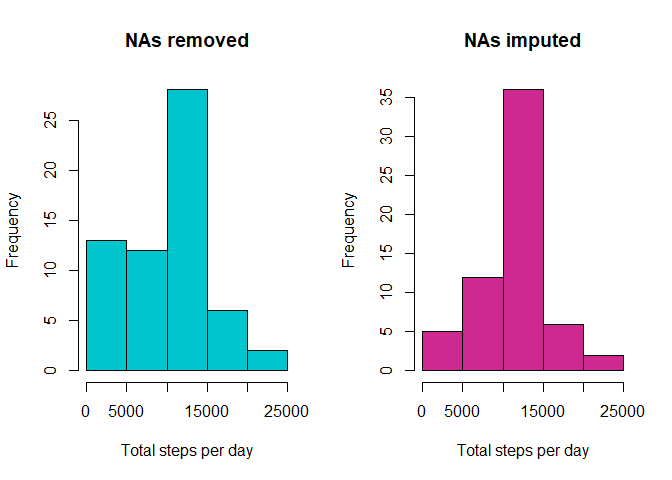
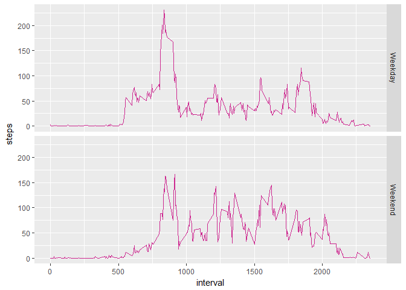

# Reproducible Research: Peer Assessment 1

My system is not in English, so I will change the weekday names to English:

```r
Sys.setlocale("LC_TIME", "English")
```

```
## [1] "English_United States.1252"
```

## Loading and preprocessing the data
We will first load the data:

```r
rawdata<-read.csv(unzip("activity.zip"))
```

To get a feel for the data, we will take a look:


```r
head(rawdata)
```

```
##   steps       date interval
## 1    NA 2012-10-01        0
## 2    NA 2012-10-01        5
## 3    NA 2012-10-01       10
## 4    NA 2012-10-01       15
## 5    NA 2012-10-01       20
## 6    NA 2012-10-01       25
```

There are only NA step numbers displyed - I wonder how many there are?


```r
summary(rawdata)
```

```
##      steps                date          interval     
##  Min.   :  0.00   2012-10-01:  288   Min.   :   0.0  
##  1st Qu.:  0.00   2012-10-02:  288   1st Qu.: 588.8  
##  Median :  0.00   2012-10-03:  288   Median :1177.5  
##  Mean   : 37.38   2012-10-04:  288   Mean   :1177.5  
##  3rd Qu.: 12.00   2012-10-05:  288   3rd Qu.:1766.2  
##  Max.   :806.00   2012-10-06:  288   Max.   :2355.0  
##  NA's   :2304     (Other)   :15840
```

To preprocess, we will convert the date column from factor to date: 


```r
rawdata$date<-as.Date(rawdata$date)
```
All done with preprocessing for now, we can continue with the analysis.


## What is mean total number of steps taken per day?
We will do the three steps as described in the assignment.

1. Calculate the total number of steps taken per day:

```r
totals<-tapply(rawdata$steps,rawdata$date,sum,na.rm=TRUE)
totals
```

```
## 2012-10-01 2012-10-02 2012-10-03 2012-10-04 2012-10-05 2012-10-06 
##          0        126      11352      12116      13294      15420 
## 2012-10-07 2012-10-08 2012-10-09 2012-10-10 2012-10-11 2012-10-12 
##      11015          0      12811       9900      10304      17382 
## 2012-10-13 2012-10-14 2012-10-15 2012-10-16 2012-10-17 2012-10-18 
##      12426      15098      10139      15084      13452      10056 
## 2012-10-19 2012-10-20 2012-10-21 2012-10-22 2012-10-23 2012-10-24 
##      11829      10395       8821      13460       8918       8355 
## 2012-10-25 2012-10-26 2012-10-27 2012-10-28 2012-10-29 2012-10-30 
##       2492       6778      10119      11458       5018       9819 
## 2012-10-31 2012-11-01 2012-11-02 2012-11-03 2012-11-04 2012-11-05 
##      15414          0      10600      10571          0      10439 
## 2012-11-06 2012-11-07 2012-11-08 2012-11-09 2012-11-10 2012-11-11 
##       8334      12883       3219          0          0      12608 
## 2012-11-12 2012-11-13 2012-11-14 2012-11-15 2012-11-16 2012-11-17 
##      10765       7336          0         41       5441      14339 
## 2012-11-18 2012-11-19 2012-11-20 2012-11-21 2012-11-22 2012-11-23 
##      15110       8841       4472      12787      20427      21194 
## 2012-11-24 2012-11-25 2012-11-26 2012-11-27 2012-11-28 2012-11-29 
##      14478      11834      11162      13646      10183       7047 
## 2012-11-30 
##          0
```

2. Make a histogram of the total number of steps taken each day:

```r
hist(totals,col="turquoise3",xlab = "Total steps per day",main = "Histogram of total steps per day")
```

<!-- -->

3. Calculate and report the mean and median of the total number of steps taken per day:

```r
totalmean<-mean(totals)
totalmedian<-median(totals)
```
The mean of the total daily steps is 9354.2295082, and the median is 10395.


## What is the average daily activity pattern?

To answer this question, we will performs two tasks as required:

1. Make a time series plot of the 5-minute interval (x-axis) and the average number of steps taken, averaged across all days (y-axis).


```r
intervalsteps<-tapply(rawdata$steps,rawdata$interval,mean,na.rm=TRUE)
plot(x=names(intervalsteps),y=intervalsteps,col="turquoise3",type = "l",ylab="Average number of steps in interval", xlab = "Interval", main = "Average number of steps per interval")
```

<!-- -->

2. Which 5-minute interval, on average across all the days in the dataset, contains the maximum number of steps?

```r
maxindex<-which.max(intervalsteps)
maxinterval<-names(intervalsteps)[maxindex]
maxval<-intervalsteps[maxindex]
```
The interval with the largest average number of steps is Interval 835 with an average of 206.1698113 steps.


## Imputing missing values
For this step, we again follow the guidelines:

1. Calculate and report the total number of missing values in the dataset (i.e. the total number of rows with NAs).

We already know from the very beginning how many NA values there are, but just for the fun of it, we will do it again:

```r
sum(is.na(rawdata))
```

```
## [1] 2304
```

2. Devise a strategy for filling in all of the missing values in the dataset. The strategy does not need to be sophisticated. For example, you could use the mean/median for that day, or the mean for that 5-minute interval, etc.

We will go with the mean value for that interval - those means are already stored in the variable **intervalsteps**.

3. Create a new dataset that is equal to the original dataset but with the missing data filled in.

We are first going to repeat the intervalsteps vector to be as long as the dataframe. At the moment, it corresponds to one day (all intervals once), so we'll find out how many days were observed and repeat it that number of times.


```r
NumOfDays<-length(unique(rawdata$date))
repmeans<-rep(intervalsteps,NumOfDays)
```
So there are 61 days and repmeans now contains the mean in the correct index for each data entry in rawdata. Now we will make a new dataset equal to rawdata, except that we replace any NAs with the corresponding entry in repmeans.


```r
imputed<-rawdata
imputed$steps[is.na(imputed$steps)]<-repmeans[is.na(imputed$steps)]
```

4. Make a histogram of the total number of steps taken each day and calculate and report the mean and median total number of steps taken per day. Do these values differ from the estimates from the first part of the assignment? What is the impact of imputing missing data on the estimates of the total daily number of steps?


```r
imputedtotals<-tapply(imputed$steps,imputed$date,sum,na.rm=TRUE)
hist(imputedtotals,col="maroon3",xlab = "Total steps per day",main = "Histogram of total steps per day (imputed)")
```

<!-- -->

To make things clearer, we will look at the two histograms side-by-side:


```r
par(mfrow=c(1,2))
hist(totals,col="turquoise3",xlab = "Total steps per day",main = "NAs removed")
hist(imputedtotals,col="maroon3",xlab = "Total steps per day",main = "NAs imputed")
```

<!-- -->


We can see that the histogram is much more symmetrical now, imputing the data shifted some low entries to the center bin between 10000 and 15000. We will look at median and mean: 

```r
imputedmean<-mean(imputedtotals)
imputedmedian<-median(imputedtotals)
```

The mean of the total daily steps is 10766, and the median is 10766. Before, the mean was 9354, and the median was 10395. We see that through imputing the missing data, the mean has drastically increased, and the median has slightly increased.


## Are there differences in activity patterns between weekdays and weekends?
We will use the imputed dataset as requested in the assignment.

1. Create a new factor variable in the dataset with two levels - "weekday" and "weekend" indicating whether a given date is a weekday or weekend day.

We will first write a function that maps the days of the week to either weekend or weekday.

```r
daytype<-function(day){
        weekend<-c("Saturday","Sunday")
        noweekend<-c("Monday","Tuesday","Wednesday","Thursday","Friday")
        res<-"dummy"
        if(is.element(day,weekend)){
                res<-"Weekend"
        }
        else if(is.element(day,noweekend)){
                res<-"Weekday"
        }
        else{
                print("Error in weekday function.")
        }
        return(res)
}
```

Now we can add a new factor variable to the imputed dataset:


```r
imputed$daytype<-as.factor(sapply(weekdays(imputed$date),daytype))
```

2. Make a panel plot containing a time series plot (i.e. type = "l") of the 5-minute interval (x-axis) and the average number of steps taken, averaged across all weekday days or weekend days (y-axis). See the README file in the GitHub repository to see an example of what this plot should look like using simulated data.


```r
library(ggplot2)
par(mfrow=c(1,1))

p<-ggplot(imputed, aes(x=interval,y=steps))+stat_summary(fun.y="mean",geom="line",colour="maroon3")+facet_grid(daytype~.)
print(p)
```

<!-- -->

We can see that during the week, the subject moves most in the morning, then moves moderately throughout the day and little in the evening. On the weekends, the subject apparently sleeps a bit longer, and then moves more consistently throughout the day before becoming more lazy in the evening.
